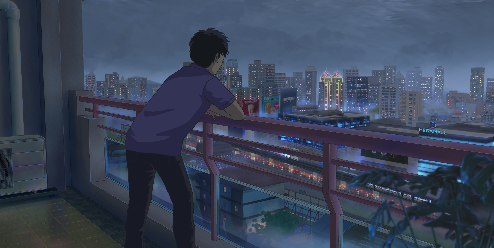

## Developing

|NAME|DESCRIPTION|TECHNOLOGIES|
|:-:|:-:|:-:|
|[Bordex](https://github.com/Bear-Frost/bordex)|React library for adding pre-styled borders to element.| |
|[Unitflip](https://github.com/zshaian/unitflip)|Javascript library that Convert your CSS units into whatever you want, no questions asked.||

